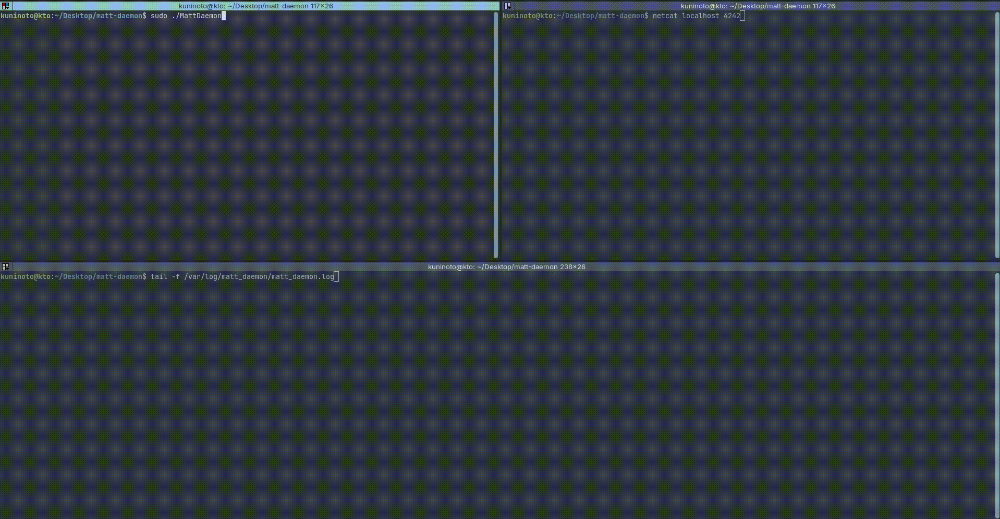

# 42_matt-daemon (42Porto - Advanced Cursus)  

#### Done in collaboration with [Nuno Machado](https://github.com/nunom4chado)  

### Description  

Simple UNIX daemon for System-V based systems (using the [double fork() technique](https://0xjet.github.io/3OHA/2022/04/11/post.html)).

### Demonstration  



### Features
- Handles 3 simultaneous clients sending messages to register on the logfile;
- "quit" command to close the daemon;
- Lock and PID file management.

### Installing and running  

1. Install required dependencies
```bash
sudo apt-get install c++ make
```

2. Clone this repository and navigate to its folder
```bash
git clone https://github.com/Kuninoto/42_matt-daemon matt-daemon && cd matt-daemon
```

3. Build and run (requires root privileges to create folders and files under `/var/log` and `/var/lock`)
```bash
sudo make run
```

### Useful links  

[Creating a daemon in Linux](https://stackoverflow.com/questions/17954432/creating-a-daemon-in-linux)  
[How to create a daemon in Linux](https://www.makeuseof.com/create-daemons-on-linux/)  
[What is a daemon - definition](https://www.makeuseof.com/what-is-a-daemon-definition/)  
[daemon man](https://man7.org/linux/man-pages/man7/daemon.7.html)  
[setsid() man](https://linux.die.net/man/2/setsid)  
[What is the reason for performing a double fork() when creating a daemon](https://stackoverflow.com/questions/881388/what-is-the-reason-for-performing-a-double-fork-when-creating-a-daemon)  
[Double fork() - why?](https://unix.stackexchange.com/questions/715248/double-fork-why)  
[Why fork() twice](https://stackoverflow.com/questions/10932592/why-fork-twice/16655124#16655124)  

### License  

This project is licensed under the GPL3 license - see the [LICENSE](LICENSE) file for more details.

---
Made by Nuno Carvalho (Kuninoto) | nnuno-ca@student.42porto.com  
<div id="badge"> <a href="https://www.linkedin.com/in/nuno-carvalho-218822247"/> &nbsp;
